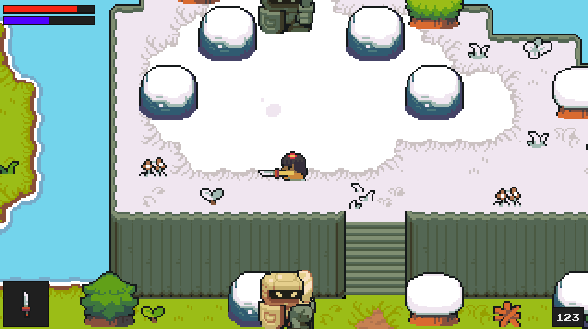
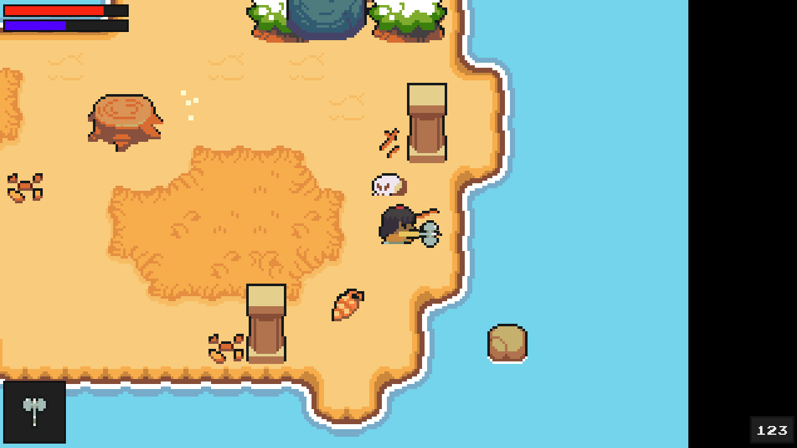

### Project Proposal: "Quest for the Nuno"

  

  

  

**Working Title:** Quest for the Nuno

**Target Platform(s):** PlayStation 5, PlayStation 4, and PlayStation Store (PSN) Digital Release

**Appeal:** "Quest for the Nuno" combines the nostalgic charm of classic RPGs with modern gameplay mechanics, offering an engaging experience reminiscent of beloved titles like "Pokémon," "The Legend of Zelda," and "Dark Souls." Players will embark on a fantastical adventure set in the lush and mysterious Philippine Islands, where they'll explore enchanted forests, ancient ruins, and vibrant villages, all while uncovering the secrets of a mythical creature known as the Nuno. The game's core appeal lies in its mix of strategic turn-based combat, open-world exploration, and rich storytelling, providing players with a deeply immersive and rewarding RPG experience.

**Positioning:** "Quest for the Nuno" is slated for release in Q4 of 2025, coinciding with the holiday season to maximize visibility and appeal. The game will be available worldwide, with a particular focus on markets in North America, Europe, and Asia. Digital distribution via the PlayStation Store will ensure broad accessibility, while physical copies will be available in limited editions to cater to collectors and fans of retro-styled games.

**Audience:** The game is designed to appeal to a broad audience, including fans of classic RPGs, indie game enthusiasts, and players who appreciate games with cultural depth and unique settings. The intended player segments include teenagers and young adults aged 13 to 35, as well as older gamers who grew up with retro games and are nostalgic for the Gameboy era. Additionally, the game aims to attract players interested in exploring diverse narratives and folklore from non-Western cultures.

**Scope:** "Quest for the Nuno" features a robust blend of exploration, combat, and puzzle-solving mechanics, all woven into a rich narrative framework. Key gameplay features include:

1. **Exploration:** An open-world map inspired by the diverse landscapes of the Philippine Islands, with regions ranging from dense forests and misty mountains to sunny beaches and subterranean caves.
   
2. **Combat:** Turn-based combat that combines the strategic depth of classic RPGs with dynamic real-time elements inspired by "Dark Souls." Players can customize their characters with various skills, spells, and weaponry.

3. **Quests and Side Missions:** A variety of main and side quests that encourage exploration and interaction with NPCs, each offering unique rewards and storylines that enrich the game world.

4. **Resource Management:** Gathering and crafting mechanics that require players to collect materials from the environment to create potions, weapons, and other useful items.

5. **Character Development:** A leveling system that allows players to build their character’s abilities and skills, tailoring them to their preferred play style.

6. **Engagement Mechanics:** Multiple endings based on player choices, encouraging replayability and deep player engagement.

**Theme:** The game is set in a richly detailed world inspired by Philippine mythology and folklore. The art style is a blend of pixel art and modern graphical enhancements, reminiscent of Gameboy-era games but with a polished, contemporary twist. The color palette is vibrant, with lush greens, deep blues, and earthy browns to reflect the natural beauty of the islands. The game’s look and feel are designed to evoke a sense of wonder and adventure, with a touch of mysticism and danger lurking around every corner.

**Supporting Visuals:** The game will be supported by a collection of concept art, character designs, and environmental illustrations that showcase its unique aesthetic. Screenshots will feature key gameplay moments, including battles against mythical creatures, exploration of hidden temples, and interactions with colorful NPCs.

### Game Narrative Overview

"Quest for the Nuno" follows the journey of a young boy named Lakan, who hails from a small fishing village on one of the Philippine Islands. Lakan's peaceful life is turned upside down when his village is struck by a mysterious curse. Crops fail, the sea yields no fish, and an eerie fog blankets the land. Legends speak of the Nuno, a mythical creature who guards the secrets of the forest and holds the key to reversing the curse. Driven by a sense of duty and a desire to save his home, Lakan sets out on a quest to find the elusive Nuno.

As Lakan ventures deeper into the island, he encounters a host of fantastical creatures inspired by Philippine folklore, from the mischievous Tikbalang to the fearsome Aswang. Each encounter presents unique challenges, requiring Lakan to use his wits, courage, and growing arsenal of weapons and spells. Along the way, he meets a diverse cast of characters—some friendly, some hostile—each with their own stories and motivations. These interactions help Lakan learn more about the land's history, the nature of the curse, and the truth about the Nuno.

The game’s narrative is rich with themes of nature, tradition, and self-discovery. Lakan's journey is not just about finding the Nuno, but also about understanding the delicate balance between humans and nature, and the importance of respecting the old ways. The story unfolds in chapters, each representing a different region of the island, with its own unique challenges and narrative arcs. This episodic structure allows players to immerse themselves in each region's distinct culture and environment, making every step of the journey feel fresh and engaging.

### Key Gameplay Mechanics

The gameplay of "Quest for the Nuno" is designed to offer a balanced mix of challenge and reward. Players will need to carefully manage their resources, plan their combat strategies, and explore every nook and cranny of the island to uncover its secrets. The game world is filled with hidden paths, secret treasures, and powerful enemies, all waiting to be discovered.

The combat system is inspired by both "Pokémon" and "Dark Souls," blending turn-based strategy with real-time action. Players can switch between characters in their party, each with unique abilities and elemental affinities that are crucial for overcoming specific enemies. For example, some creatures might be vulnerable to fire-based attacks, while others require a more defensive approach. Players can also capture and tame certain creatures, much like in "Pokémon," adding another layer of strategy to the game.

The game also incorporates a unique "spirit link" mechanic, where Lakan can form bonds with certain creatures and NPCs. These bonds allow him to call upon their aid in battle or receive special bonuses. Building and maintaining these relationships is a key aspect of the game, as different bonds can lead to different outcomes in the story.

### Visual and Audio Design

The visual design of "Quest for the Nuno" is heavily inspired by traditional Filipino art and mythology. The environments are lush and detailed, with a focus on natural beauty and mystical elements. The character designs are vibrant and distinct, each reflecting the cultural heritage of the Philippines while also appealing to a global audience. 

The game’s soundtrack features a blend of traditional Filipino instruments and modern orchestral compositions, creating an immersive audio experience that enhances the game’s atmosphere. Each region of the island has its own unique musical theme, reflecting its environment and culture. Sound effects are carefully designed to add depth and realism to the game world, from the rustling of leaves to the roar of mythical beasts.

### Conclusion

"Quest for the Nuno" aims to be more than just another RPG. It is a journey into a rich and vibrant world, filled with mystery, danger, and wonder. By blending traditional RPG mechanics with a unique cultural narrative and modern gameplay innovations, the game seeks to offer an experience that is both familiar and fresh, appealing to a wide range of players. 

We believe that "Quest for the Nuno" has the potential to be a standout title on the PlayStation platform, captivating players with its unique setting, engaging gameplay, and deep storytelling. We are excited to bring this project to life and share it with the world.
